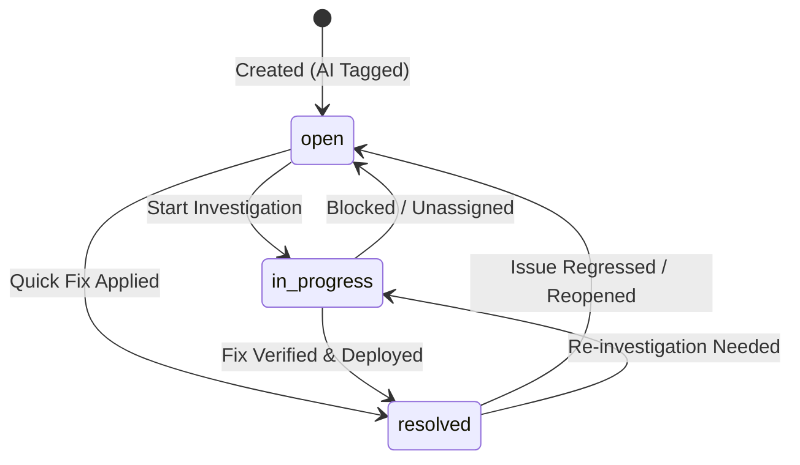

# Issue Lifecycle & Status Transitions Specification

This specification defines the product requirements, operational rules, and state machine transitions for incident tracking in SmartFlow.

---

## 1. Issue Statuses

SmartFlow tracks issues through three active lifecycle states:

| Status | Label | Color Theme | Description |
| :--- | :--- | :--- | :--- |
| **`open`** | **Open** | Rose / Red (`bg-rose-50`) | Newly submitted incident that has undergone AI diagnosis and awaits engineer triage or assignment. |
| **`in_progress`** | **In Progress** | Amber (`bg-amber-100`) | Actively investigated by an engineer or team; remediation is underway. |
| **`resolved`** | **Resolved** | Teal / Green (`bg-teal-50`) | Diagnostic root cause mitigated, fix verified, or issue marked closed. |

*(Note: `closed` is reserved for administrative archiving and cannot be set via standard engineer status updates).*

---

## 2. State Transition Machine

Issues can transition dynamically between statuses as investigation progresses:



---

## 3. Allowed Transition Rules

1. **Reopen Guarantee:** Any `resolved` or `in_progress` issue can be moved back to `open` if a bug recurs or was prematurely resolved.
2. **Transition Validation:** Only status values in `['open', 'in_progress', 'resolved']` are accepted. Any other value (e.g. `closed`, `pending`, `archived`) is rejected with a **`400 Bad Request`**.
3. **Audit Immutability:**
   - `id` and `createdAt` are immutable and must never be altered during a status update.
   - `updatedAt` must be set to the current ISO-8601 timestamp whenever status transitions.

---

## 4. API Endpoints & Request Contracts

### Endpoint 1: Sub-resource Status Update
- **Method:** `PATCH`
- **Path:** `/api/issues/:id/status`
- **Headers:** `Content-Type: application/json`
- **Request Body:**
  ```json
  {
    "status": "in_progress"
  }
  ```

### Endpoint 2: Resource Patch
- **Method:** `PATCH`
- **Path:** `/api/issues/:id`
- **Request Body:**
  ```json
  {
    "status": "resolved"
  }
  ```

### Responses
- **`200 OK`**: Returns the complete, updated `Issue` object.
- **`400 Bad Request`**: Malformed UUID or status not in `['open', 'in_progress', 'resolved']`.
- **`404 Not Found`**: Target UUID does not exist in the database.
- **`500 Internal Server Error`**: Unexpected database or server failure.

---

## 5. UI Requirements

- **Issue List Table:** Status must be prominently displayed using high-contrast color badges.
- **Issue Detail Modal:** Provides interactive 1-click status switcher buttons (`Open`, `In Progress`, `Resolved`) with a real-time loading spinner and error alert feedback.
